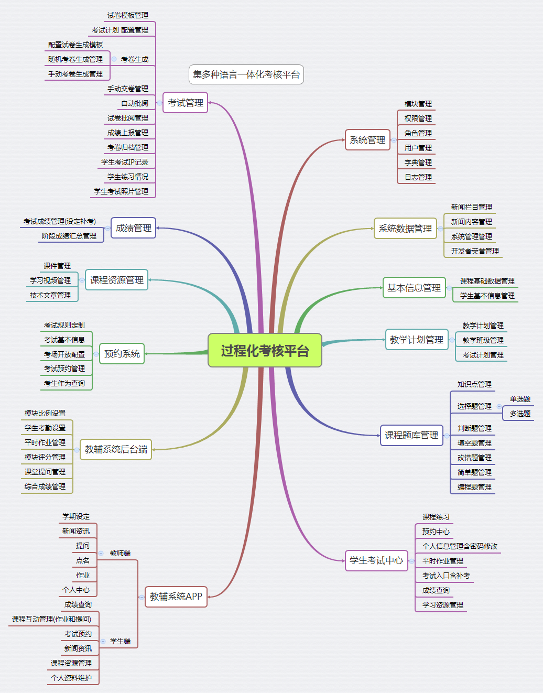

Exam_System
==============

    OJ : 修改后的考试系统的在线判题系统判题系统

# 判题系统文档

### 编译系统是把网上一开源Online Judge 编译部分抽出

[GitHub源码及其简略文档](https://github.com/zhblue/hustoj)

[Online Judge开发者博客（有关于编译系统的干货）](http://www.hustoj.com/)

[编译系统源码解读（可以去看一看）](http://blog.csdn.net/legan/article/category/2683689)

**此编译系统只能ubuntu  apache php5 环境下才能运行，ubuntu尽量为14版本为最佳**

_当前服务器使用的此步骤快速安装的_
<pre>快速安装指南：
1、安装Ubuntu 14.04 LTS  (16.04 need the php7 branch)
2、执行如下命令
    sudo apt-get update
    sudo apt-get install subversion
    sudo svn co https://github.com/zhblue/hustoj/trunk/trunk/install hustoj
    cd hustoj
    sudo bash install-interactive.sh
3、安装后访问服务器80端口上的web服务JudgeOnline目录
    例如 w3m http://127.0.0.1/JudgeOnline</pre>

### 数据库介绍
<pre>problem    问题表
solution    编译记录表
source_code     存储需要编译的代码
source_user_code    和上表一样（具体我也不知道干什么的）
compileinfo    编译错误时错误信息表
custominput   在线编译时输入的数据
runtimeinfo     在线编译时输出的数据</pre>

### 流程介绍
    1. Web插入数据到Solution等表
    2. 编译器轮询Solution表，发现新记录
    3. 编译器编译，并修改Solution表的result字段
    4. Web查询Solution表的result字段得到结果

### 源码中定义,Solution表result字段值
    #define OJ_WT0 0    => 未编译
    #define OJ_WT1 1    =>
    #define OJ_CI 2     => 正在编译,可能是等待程序源码
    #define OJ_RI 3     =>
    #define OJ_AC 4     => 编译成功,结果和测试用例相同
    #define OJ_PE 5     =>
    #define OJ_WA 6     => 结果和测试用例不同
    #define OJ_TL 7     => 运行超时
    #define OJ_ML 8     =>
    #define OJ_OL 9     =>
    #define OJ_RE 10    =>
    #define OJ_CE 11    => 编译失败,语法错误
    #define OJ_CO 12    =>
    #define OJ_TR 13    =>

## 对文件题的支持
    * 1，修改判题系统（judge_client.cc）源码，把需要读取的文件cp到判题工作目录下
    * 2，允许判题系统对SYS_OPEN,SYS_WRITE,SYS_CLOSE的操作
    * 3，重新make判题系统，覆盖/usr/bin/judge_client

### 学生端编译
<pre>判题系统在源码中加入
execute_cmd("/bin/cp %s/data/%d/* %s/", oj_home, p_id, work_dir);
（每次判题时把需要的文件读入到工作目录中）
重新make判题系统，覆盖/usr/bin/judge_client
考试系统中的编译部分，每次循环测试用例的时候，执行
shell_exec("cp /home/judge/file/".$ID."/* /home/judge/data/".$ProblemId);
把该题的所有需要的文件复制到/home/judge/dada/$ProblemId下，当前测试用例的工作目录</pre>

### 老师端获取文件题的测试用例的输出
<pre>在老师端，修改以前的获取测试用例办法，统一使用和学生端测试代码方法一样，
在judge_client.ccz中在每次获编译后把信息写到runtimeerro中
添加代码addcustomout(solution_id);重新make覆盖/usr/bin/judge_client</pre>

### 对C语言#include "user.h"(老师自己写的.h文件)的支持
<pre>算法设计与实现中，有老师自己写的.h文件需要包含在源码中一起进行编译，
所以在判题系统源码中编译之前加入了
shell_exec("cp /home/judge/file/".$ID."/* /home/judge/data/".$ProblemId);
重新make生成判题系统，这个应该对以后java的多文件编译也能直接支持了（没测试java）</pre>

### 流程
    管理员建立学期
    老师建立班级
    老师给班级导入学生
        学生可以练习相应课程的题目
    老师建立考试模板
    老师建立考试计划
    老师生成试卷
    老师开放考试计划
        学生可以进行考试
    老师批阅试卷
    老师上报成绩
    老师归档试卷
